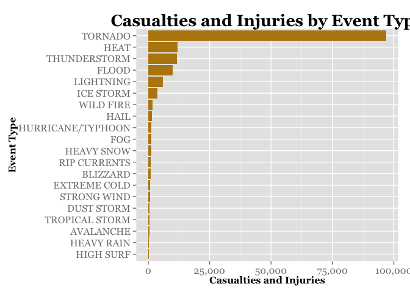
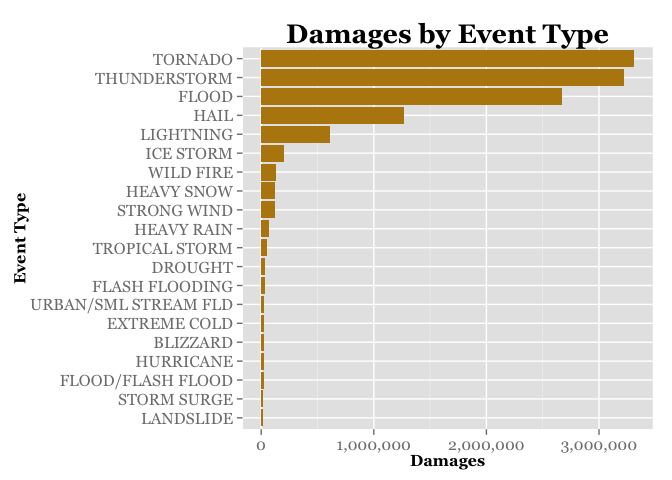

# Coursera - Data Science Specialization - Reproducible Research - Peer Assessment 2
Regis Cabaret  
23 August, 2015  

# ANALYSIS OF STORM & OTHER SEVERE WEATHER EVENTS IN THE UNITED STATES

## SUMMARY

Tornadoes and thunderstorms, both wind-based cataclysms, are the leading weather events in term of damage to human lifes, having caused more than 100,000 victims over the past 100 years.
Thunderstorm winds bring the most damage to property and crops, generating 


```r
library(ggplot2)
library(extrafont)
```

```
## Warning: package 'extrafont' was built under R version 3.1.3
```

```
## Registering fonts with R
```

```r
library(plyr)
font_import()
```

```
## Importing fonts may take a few minutes, depending on the number of fonts and the speed of the system.
## Continue? [y/n]
```

```
## Exiting.
```

## DATA PROCESSING

### SOURCE DATA DOWNLOAD


```r
file.url <- "https://d396qusza40orc.cloudfront.net/repdata%2Fdata%2FStormData.csv.bz2"
if (! file.exists("data")) dir.create("data")
download.file(file.url,destfile = "data/stormdata.csv.bz2",method="curl")
```

Read the csv file into a data frame

```r
storm.data <- read.csv("data/stormdata.csv.bz2",strip.white=TRUE,sep=",",na.strings="NA")
```

### DATA CLEANSING AND NORMALIZING

Noticed some duplicate names in EVTYPE due to typo, case difference and other data quality issues
Due to the fact that they are many typo, the renaming below is based on the findings further down
When finding two similar events in name in the top 20 of most damaging for health or economy, proceeded to some renaming


```r
storm.data$EVTYPE <- toupper(storm.data$EVTYPE)
storm.data[storm.data$EVTYPE=="AVALANCE",]$EVTYPE <- "AVALANCHE"
storm.data[storm.data$EVTYPE=="DRY MIRCOBURST WINDS",]$EVTYPE <- "DRY MICROBURST WIND"
storm.data[storm.data$EVTYPE=="DRY MICROBURST WINDS",]$EVTYPE <- "DRY MICROBURST WIND"
storm.data[storm.data$EVTYPE=="WATERSPOUT TORNADO",]$EVTYPE <- "WATERSPOUT/TORNADO"
storm.data[storm.data$EVTYPE=="WATERSPOUT-TORNADO",]$EVTYPE <- "WATERSPOUT/TORNADO"
storm.data[storm.data$EVTYPE=="WATERSPOUT/ TORNADO",]$EVTYPE <- "WATERSPOUT/TORNADO"
storm.data[storm.data$EVTYPE=="WATERSPOUT-",]$EVTYPE <- "WATERSPOUT"
storm.data[storm.data$EVTYPE=="THUNDERSTORMS WIND",]$EVTYPE <- "THUNDERSTORM WIND"
storm.data[storm.data$EVTYPE=="THUNDERSTORM  WINDS",]$EVTYPE <- "THUNDERSTORM WIND"
storm.data[storm.data$EVTYPE=="THUNDERSTORM WINDS      LE CEN",]$EVTYPE <- "THUNDERSTORM WIND"
storm.data[storm.data$EVTYPE=="THUNDERSTORM WINDSS",]$EVTYPE <- "THUNDERSTORM WIND"
storm.data[storm.data$EVTYPE=="THUNDERSTORMS WINDS",]$EVTYPE <- "THUNDERSTORM WIND"
storm.data[storm.data$EVTYPE=="HEAVY SNOW AND ICE STORM",]$EVTYPE <- "HEAVY SNOW/ICE STORM"
storm.data[storm.data$EVTYPE=="LIGHTNING.",]$EVTYPE <- "LIGHTNING"
storm.data[storm.data$EVTYPE=="SNOW SQUALLS",]$EVTYPE <- "SNOW SQUALL"
storm.data[storm.data$EVTYPE=="WINTER STORMS",]$EVTYPE <- "WINTER STORM"
storm.data[storm.data$EVTYPE=="EXCESSIVE HEAT",]$EVTYPE <- "HEAT"
storm.data[storm.data$EVTYPE=="HEAT WAVE",]$EVTYPE <- "HEAT"
storm.data[storm.data$EVTYPE=="FLASH FLOOD",]$EVTYPE <- "FLOOD"
storm.data[storm.data$EVTYPE=="TSTM WIND",]$EVTYPE <- "THUNDERSTORM WIND"
storm.data[storm.data$EVTYPE=="WINTER STORM",]$EVTYPE <- "ICE STORM"
storm.data[storm.data$EVTYPE=="WINTER WEATHER",]$EVTYPE <- "EXTREME COLD"
storm.data[grep("WILD.*FIRE",storm.data$EVTYPE),]$EVTYPE <- "WILD FIRE"
storm.data[storm.data$EVTYPE=="RIP CURRENT",]$EVTYPE <- "RIP CURRENTS"
storm.data[storm.data$EVTYPE=="HIGH WIND",]$EVTYPE <- "THUNDERSTORM WIND"
storm.data[storm.data$EVTYPE=="HEAVY PRECIPATATION",]$EVTYPE <- "HEAVY RAIN"
storm.data[grep("HEAVY RAIN*",storm.data$EVTYPE),]$EVTYPE <- "HEAVY RAIN"
storm.data[grep("TSTM.*",storm.data$EVTYPE),]$EVTYPE <- "THUNDERSTORM WIND"
storm.data[storm.data$EVTYPE=="TUNDERSTORM WIND",]$EVTYPE <- "THUNDERSTORM WIND"
storm.data[storm.data$EVTYPE=="THUNDERTSORM WIND",]$EVTYPE <- "THUNDERSTORM WIND"
storm.data[storm.data$EVTYPE=="THUNDESTORM WINDS",]$EVTYPE <- "THUNDERSTORM WIND"
storm.data[grep("THUNDERSTORM*",storm.data$EVTYPE),]$EVTYPE <- "THUNDERSTORM"
storm.data[grep("HAIL*",storm.data$EVTYPE),]$EVTYPE <- "HAIL"
storm.data[grep("FOG",storm.data$EVTYPE),]$EVTYPE <- "FOG"
storm.data[storm.data$EVTYPE=="HIGH WINDS",]$EVTYPE <- "STRONG WIND"
storm.data[storm.data$EVTYPE=="SNOW FREEZING RAIN",]$EVTYPE <- "SNOW/FREEZING RAIN"
storm.data[storm.data$EVTYPE=="HEAT DROUGHT",]$EVTYPE <- "HEAT/DROUGHT"
storm.data[storm.data$EVTYPE=="HEAVY SNOW-SQUALLS",]$EVTYPE <- "HEAVY SNOW/SQUALLS"
```

There were also some leading and trailing whitespaces in EVTYPE values, those are trimmed using the stringr package


```r
if(! is.element("stringr", installed.packages()[,1])) install.packages("stringr")
library(stringr)
storm.data$EVTYPE <- str_trim(storm.data$EVTYPE)
storm.data$YEAR <- format(as.Date(storm.data$BGN_DATE,format = "%m/%d/%Y"), "%Y")
```

We measure effects on health by adding the number of injuries and number of fatalities for each EVTYPE


```r
health.effects.data <- ddply(storm.data,.(EVTYPE),summarize,HEALTH.EFFECTS=sum(INJURIES + FATALITIES,rm.na=TRUE))
health.effects.data <- health.effects.data[order(-health.effects.data$HEALTH.EFFECTS),]
```

We measure economic effects by adding the property and crop damages for each EVTYPE


```r
eco.effects.data <- ddply(storm.data,.(EVTYPE),summarize,DAMAGES=sum(PROPDMG + CROPDMG,rm.na=TRUE))
eco.effects.data <- eco.effects.data[order(-eco.effects.data$DAMAGES),]
```

## RESULTS

Note: more than 95% of damages and effects on human life are cause by the first 20 event types. To make bar charts more readable, I only  display those 20 types. 


```r
ggplot(health.effects.data[0:20,], aes(
  y = health.effects.data[0:20,]$HEALTH.EFFECTS,
  x = reorder(health.effects.data[0:20,]$EVTYPE,health.effects.data[0:20,]$HEALTH.EFFECTS)
  )) +
  geom_bar(fill=colors()[75],stat = "identity") + 
  coord_flip() + 
  xlab("Event Type") + 
  ylab("Casualties and Injuries") + 
  ggtitle("Casualties and Injuries by Event Type") + 
  theme(
    plot.title = element_text(family="Georgia",face="bold",size=20),
    axis.title=element_text(family="Georgia",face="bold",size=12),
    axis.text=element_text(family="Georgia",size=12)
    ) +
  scale_y_continuous(labels = function(x) format(x, big.mark = ',', trim = TRUE, scientific = FALSE))
```

 

Similarly to health effects, most of the damages are caused by the top 10 weather event types, so only plotting those for better visibility


```r
ggplot(eco.effects.data[0:20,], aes(
  y = eco.effects.data[0:20,]$DAMAGES,
  x = reorder(eco.effects.data[0:20,]$EVTYPE,eco.effects.data[1:20,]$DAMAGES)
  )) + 
  geom_bar(fill=colors()[75],stat = "identity") + 
  coord_flip() + 
  xlab("Event Type") + 
  ylab("Damages") + 
  ggtitle("Damages by Event Type") + 
  theme(
    plot.title = element_text(family="Georgia",face="bold",size=20),
    axis.title=element_text(family="Georgia",face="bold",size=12),
    axis.text=element_text(family="Georgia",size=12)
    ) +
  scale_y_continuous(labels = function(x) format(x, big.mark = ',', trim = TRUE, scientific = FALSE))
```

 
